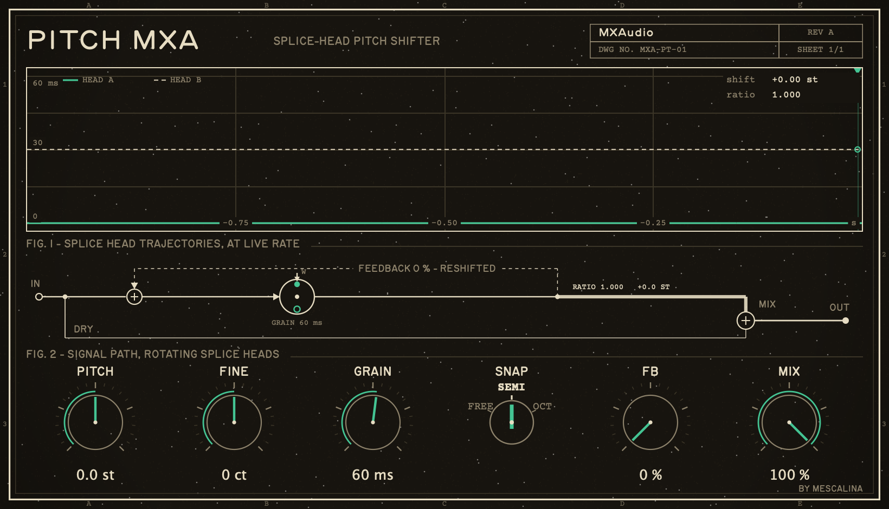

# PitchMXA

A splice-head pitch shifter (tape-splice / H910 method): two read heads sweep a circular buffer at the transposition rate, half a window apart, sin/cos crossfaded; feedback reshifts each repeat (the spiral).



Audio plugin (AU / VST3 / Standalone) built with [JUCE](https://juce.com). Part of the [MXA plugin suite](https://mxaudio.mescalina.fr/). macOS 11+ and Windows — Windows builds (VST3 + Standalone) are available in [Releases](https://github.com/uprod/PitchMXA/releases).

## Build

```sh
git clone --recurse-submodules https://github.com/uprod/PitchMXA.git
cd PitchMXA
cmake -B build -DCMAKE_BUILD_TYPE=Release
cmake --build build
```

If you already have the MXA suite checked out with a shared `../JUCE` folder, the submodule is optional — the build falls back to the sibling folder automatically.
